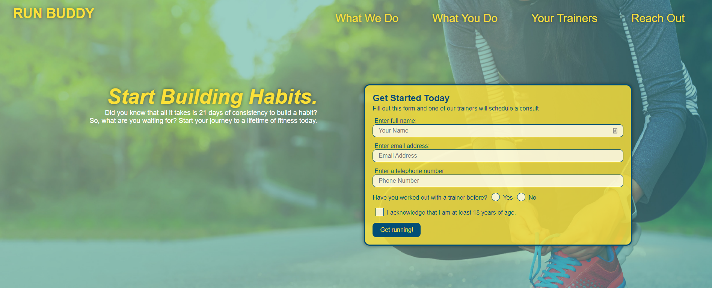

# Run Buddy

## Table of Contents
* [Deployed](#deployed)
* [Description](#description)
* [Technologies](#technologies)
* [Usage](#usage)
* [Preview](#preview)
* [Questions](#questions)
* [Credits](#credits)

## Deployed
Access the website [here](https://sarawrmas.github.io/run-buddy/)

## Description
This application is a resource for runners to find a personal trainer who fits their needs. Whether you're looking to increase your strength, speed, endurance, or overall fitness, Run Buddy has the trainer for you.

## Technologies
* HTML
* CSS

## Usage
This is a single page application with a navigation menu that will auto-scroll to the given section on the page.

The form in the hero can be filled out and submitted to reach out to a personal trainer.

'What We Do' is a quick summary about Run Buddy's purpose.

'What You Do' is a call to action containing 4 steps to begin your fitness journey.

'Meet the Trainers' is a section where you can learn about 3 of Run Buddy's personal trainers, including their name, photo, specialty, and a short description.

'Reach Out' contains 3 sections on how to get in touch with Run Buddy. Contact info is listed along with a contact form and an interactive map.

The footer contains a link that will open up Run Buddy's Privacy Policy in a new tab. This page contains all of the relevant information about Run Buddy's terms of use.

## Preview

## Questions
Have questions about this project?  
GitHub: https://github.com/sarawrmas  
Email: sara.m.adamski@gmail.com

## Credits
Sara Adamski